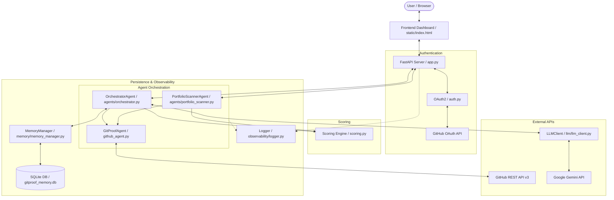

# GitProof Agent

> **Autonomous Multi-Agent GitHub Skill & Contribution Verification Platform**
> Deterministic evidence scanning, cryptographic commit verification, portfolio intelligence, and LLM-powered candidate insights backed by real GitHub contributions.

---

## Table of Contents

- [Overview](#overview)
- [Key Features](#key-features)
- [System Architecture](#system-architecture)
- [Repository & File Structure](#repository--file-structure)
- [File-by-File Detailed Breakdown](#file-by-file-detailed-breakdown)
  - [Core Application & Server](#core-application--server)
  - [Agents Subsystem](#agents-subsystem)
  - [LLM & Reasoning](#llm--reasoning)
  - [Memory & Persistence](#memory--persistence)
  - [Observability & Telemetry](#observability--telemetry)
  - [Frontend UI](#frontend-ui)
  - [Testing Suite](#testing-suite)
  - [Configuration & Environment](#configuration--environment)
- [Deterministic Scoring Engine](#deterministic-scoring-engine)
- [API Endpoints Reference](#api-endpoints-reference)
- [Getting Started](#getting-started)
  - [Prerequisites](#prerequisites)
  - [1. GitHub OAuth App Setup](#1-github-oauth-app-setup)
  - [2. Environment Configuration](#2-environment-configuration)
  - [3. Installation & Execution](#3-installation--execution)
- [Running Tests](#running-tests)
- [Security & Rate Limiting](#security--rate-limiting)
- [License](#license)

---

## Overview

**GitProof** is an agentic evaluation tool designed to replace self-reported resumes and unverified coding claims with verifiable, empirical data fetched directly from GitHub via OAuth.

Instead of generic vanity metrics (like star counts or raw commit numbers), GitProof performs a multi-dimensional inspection:
- Evaluates **exact line diffs** and file extensions matched against claimed languages.
- Identifies **commit frequency, recency, and decay** over time.
- Verifies **GPG/SSH cryptographic commit signatures** to prevent email spoofing attacks.
- Analyzes **Pull Request discussions and merged contributions**.
- Leverages an **LLM Reasoning Agent** (Google Gemini) to synthesize qualitative findings, detect anomalies, and extract self-improving lessons over time.

---

## Key Features

- **GitHub OAuth 2.0 & CLI Auth**: Zero manual Personal Access Token (PAT) copy-pasting. Fast login via web OAuth or 1-click GitHub CLI (`gh`) token exchange.
- **Deterministic Evidence Scoring**: Transparent, verifiable scoring formula spanning commit volume, file changes, recency, and signature verification.
- **Multi-Agent Architecture**:
  - **Orchestrator Agent**: Coordinates memory cache lookups, data ingestion, scoring, and LLM reasoning.
  - **GitProof Agent**: Traverses GitHub REST APIs, repositories, commits, file diffs, and pull requests.
  - **Portfolio Scanner Agent**: Cross-repository skill aggregator detecting language distributions and producing portfolio-wide matrices.
- **Dual-Layer Memory System**: SQLite-backed episodic scan cache (1-hour TTL) + semantic lesson memory derived from user feedback loops.
- **Adversarial & Attack Resistance**: Resilient against commit date spoofing, empty commit spamming, email impersonation, and prompt injection attempts.
- **Modern Dashboard UI**: Clean, responsive interface with dark mode styling, real-time log streaming, and detailed score breakdowns.

---

## System Architecture



---

## Repository & File Structure

```
gitproof/
├── .env.example                     # Environment variables configuration template
├── .gitignore                       # Git ignore patterns (virtualenvs, cache, DBs, secrets)
├── LICENSE                          # MIT License file
├── README.md                        # Comprehensive project documentation
├── requirements.txt                 # Python project dependencies
├── app.py                           # FastAPI web application entrypoint & API routes
├── auth.py                          # GitHub OAuth2 authentication & session handler
├── github_agent.py                  # GitHub API data extraction & evidence collector
├── scoring.py                       # Deterministic mathematical scoring engine
│
├── agents/                          # Autonomous multi-agent coordination layer
│   ├── __init__.py                  # Agents package initializer
│   ├── orchestrator.py              # OrchestratorAgent (coordinates memory, scan, LLM)
│   └── portfolio_scanner.py         # PortfolioScannerAgent (multi-repo portfolio analysis)
│
├── llm/                             # LLM reasoning & qualitative synthesis
│   ├── __init__.py                  # LLM package initializer
│   └── llm_client.py                # Gemini LLM client, prompt templates & lesson extraction
│
├── memory/                          # Persistent storage & self-learning memory
│   ├── __init__.py                  # Memory package initializer
│   └── memory_manager.py            # SQLite memory manager (episodic cache & feedback lessons)
│
├── observability/                   # Logging, telemetry, and execution tracing
│   ├── __init__.py                  # Observability package initializer
│   └── logger.py                    # Colored structured console logger
│
├── static/                          # Web interface assets
│   └── index.html                   # Interactive frontend single-page dashboard
│
└── tests/                           # Test suites (integration & adversarial tests)
    ├── __init__.py                  # Tests package initializer
    ├── test_agents_attack.py        # Adversarial attack tests (spoofing, prompt injections)
    └── test_agents_integration.py   # End-to-end multi-agent integration tests
```

---

## File-by-File Detailed Breakdown

### Core Application & Server

#### `app.py`
- **Purpose**: The central FastAPI application server.
- **Responsibilities**:
  - Sets up session middleware (`SessionMiddleware`) for signed, encrypted cookie sessions.
  - Exposes REST API endpoints for user authentication, repository listings, single-repo analysis, portfolio scanning, user feedback, and lesson introspection.
  - Provides a single-click local CLI login (`/api/cli-login`) using authenticated GitHub CLI sessions.
  - Mounts the `static/` directory to serve the frontend single-page application.

#### `auth.py`
- **Purpose**: GitHub OAuth 2.0 lifecycle management.
- **Responsibilities**:
  - Generates cryptographically secure `state` tokens to defend against CSRF attacks.
  - Constructs OAuth authorization URLs with required scopes (`read:user`, `repo`).
  - Exchanges one-time authorization codes for GitHub access tokens via `https://github.com/login/oauth/access_token`.
  - Fetches the authenticated user profile (username, user ID, avatar URL, display name).

#### `github_agent.py`
- **Purpose**: GitHub REST API client and evidence extraction agent.
- **Responsibilities**:
  - Implements `GitProofAgent` with pagination support, error resilience, and rate-limit awareness.
  - Retrieves repository metadata (stars, forks, languages, default branch).
  - Fetches user-authored commits and inspects per-commit file modifications, additions, and deletions.
  - Verifies cryptographic commit signatures (GPG / SSH / S/MIME).
  - Searches and aggregates Pull Requests authored by the candidate using GitHub's issue search API.
  - Maps file extensions to skill identifiers via `SKILL_EXTENSIONS`.

#### `scoring.py`
- **Purpose**: Deterministic, verifiable scoring engine.
- **Responsibilities**:
  - Calculates a standardized score (0 to 100) based on mathematical formulas without LLM randomness.
  - Evaluates commit volume, lines added/removed, recency decay (exponential decay over time), active day span, and signed commit percentage.
  - Assigns categorical ratings (`None`, `Novice`, `Competent`, `Proficient`, `Expert`).
  - Outputs a detailed sub-score breakdown (`volume`, `breadth`, `recency`, `verification`).

---

### Agents Subsystem

#### `agents/__init__.py`
- **Purpose**: Module initializer for multi-agent workflows.

#### `agents/orchestrator.py`
- **Purpose**: The main coordinator agent (`OrchestratorAgent`).
- **Responsibilities**:
  - Coordinates the 8-step pipeline: Input validation $\to$ Episodic cache check $\to$ Lesson retrieval $\to$ GitHub evidence extraction $\to$ Deterministic scoring $\to$ LLM qualitative reasoning $\to$ Persistent storage $\to$ Response formatting.
  - Automatically incorporates historical lessons from past user feedback to refine qualitative analysis.

#### `agents/portfolio_scanner.py`
- **Purpose**: Multi-repository portfolio analyzer (`PortfolioScannerAgent`).
- **Responsibilities**:
  - Concurrently scans all accessible repositories for a given developer using a `ThreadPoolExecutor`.
  - Aggregates language distributions and commit stats across the user's entire GitHub profile.
  - Generates a comprehensive skill matrix highlighting primary and secondary competencies.

---

### LLM & Reasoning

#### `llm/__init__.py`
- **Purpose**: Module initializer for LLM integration.

#### `llm/llm_client.py`
- **Purpose**: Google Gemini LLM interface and qualitative analysis engine (`LLMClient`).
- **Responsibilities**:
  - Manages connections to Google Gemini models (`gemini-1.5-flash`, `gemini-1.5-pro`).
  - Generates qualitative summaries, strengths, risks, and anomaly flags based on evidence and past lessons.
  - Extracts actionable lessons from user feedback when a score or assessment is disputed or corrected.
  - Gracefully falls back to deterministic rule-based summaries if the LLM key is absent or unreachable.

---

### Memory & Persistence

#### `memory/__init__.py`
- **Purpose**: Module initializer for persistent storage.

#### `memory/memory_manager.py`
- **Purpose**: SQLite-based dual-layer persistence manager (`MemoryManager`).
- **Responsibilities**:
  - **Episodic Cache Table (`analyses`)**: Caches complete repository scan results for 1 hour to prevent redundant API calls and rate-limit exhaustion.
  - **Semantic Lessons Table (`lessons`)**: Stores structured lessons, corrections, and contextual triggers extracted from user feedback.
  - **Feedback Table (`feedback`)**: Logs user thumbs-up/down ratings, score corrections, and comments.

---

### Observability & Telemetry

#### `observability/__init__.py`
- **Purpose**: Module initializer for logging utilities.

#### `observability/logger.py`
- **Purpose**: Structured, colorized logging utility.
- **Responsibilities**:
  - Formats console output with ANSI colors, timestamps, log levels, and module names for clear debugging and agent execution tracing.

---

### Frontend UI

#### `static/index.html`
- **Purpose**: Single-page frontend web application.
- **Responsibilities**:
  - Modern, responsive dashboard built with clean CSS glassmorphism, gradients, and micro-animations.
  - Displays OAuth login state, connected GitHub user profile, repository selectors, and custom skill inputs.
  - Renders live progress steps, score gauge rings, sub-score bars, cryptographic verification badges, and LLM qualitative insights.
  - Provides an interactive feedback modal for submitting corrections and rating assessments.

---

### Testing Suite

#### `tests/__init__.py`
- **Purpose**: Test package initializer.

#### `tests/test_agents_integration.py`
- **Purpose**: End-to-end multi-agent integration tests.
- **Responsibilities**:
  - Tests OAuth flow mocks, orchestrator execution, memory caching, lesson retrieval, and portfolio scanner operations with mock GitHub data.

#### `tests/test_agents_attack.py`
- **Purpose**: Adversarial robustness and attack test suite.
- **Responsibilities**:
  - Validates defense against commit timestamp spoofing, unverified author email attacks, mass-commit spamming, and prompt injection attempts against the LLM evaluator.

---

### Configuration & Environment

#### `.env.example`
- **Purpose**: Configuration template for environment variables (`GITHUB_CLIENT_ID`, `GITHUB_CLIENT_SECRET`, `SESSION_SECRET`, `GEMINI_API_KEY`, `MEMORY_DB_PATH`).

#### `.gitignore`
- **Purpose**: Specifies patterns to exclude virtual environments, Python bytecode, `.env` secret files, SQLite database files, and test caches from version control.

#### `requirements.txt`
- **Purpose**: Lists production and testing Python dependencies (`fastapi`, `uvicorn`, `httpx`, `python-dotenv`, `google-genai`, `pytest`, `starlette`).

#### `LICENSE`
- **Purpose**: MIT Open Source License.

---

## Deterministic Scoring Engine

The scoring algorithm calculates a skill proof rating (0–100) using four weighted dimensions:

$$\text{Final Score} = S_{\text{volume}} + S_{\text{breadth}} + S_{\text{recency}} + S_{\text{verification}}$$

| Dimension | Max Points | Metric Evaluated |
|---|---|---|
| **Volume ($S_{\text{volume}}$)** | 35 pts | Number of relevant commits, lines added, and files modified matching the target skill |
| **Breadth ($S_{\text{breadth}}$)** | 25 pts | Variety of files touched, directory depth, and merged pull request contributions |
| **Recency ($S_{\text{recency}}$)** | 25 pts | Exponential recency decay based on days elapsed since the latest contributions |
| **Verification ($S_{\text{verification}}$)** | 15 pts | Proportion of commits with valid GPG/SSH cryptographic signatures |

---

## API Endpoints Reference

| Method | Endpoint | Description | Auth Required |
|---|---|---|:---:|
| `GET` | `/auth/login` | Redirects user to GitHub OAuth authorization screen | No |
| `GET` | `/auth/callback` | Handles OAuth callback, exchanges code for access token | No |
| `POST` | `/auth/logout` | Clears active session and revokes cookie | Yes |
| `POST` | `/api/cli-login` | Authenticates using local GitHub CLI (`gh`) token | No |
| `GET` | `/api/me` | Returns profile data of the connected user | Yes |
| `GET` | `/api/repos` | Lists all repositories accessible to the connected token | Yes |
| `POST` | `/api/analyze` | Runs full Orchestrator analysis for a repo & skill | Yes |
| `POST` | `/api/portfolio` | Scans entire repository portfolio for candidate skills | Yes |
| `POST` | `/api/feedback` | Submits feedback & triggers lesson extraction | Yes |
| `GET` | `/api/lessons` | Retrieves stored self-improving lessons | No |
| `GET` | `/api/status` | Reports memory database statistics and LLM status | No |

---

## Getting Started

### Prerequisites

- **Python 3.10+** installed
- A **GitHub Account** (and optionally [GitHub CLI](https://cli.github.com/) `gh`)
- *(Optional)* A **Google Gemini API Key** from [Google AI Studio](https://aistudio.google.com/) for LLM reasoning.

### 1. GitHub OAuth App Setup

1. Go to **GitHub Settings** $\to$ **Developer Settings** $\to$ **OAuth Apps** $\to$ **[New OAuth App](https://github.com/settings/developers)**.
2. Fill in the application details:
   - **Application name**: `GitProof Agent`
   - **Homepage URL**: `http://localhost:8000`
   - **Authorization callback URL**: `http://localhost:8000/auth/callback`
3. Click **Register application**, then copy the **Client ID** and generate a **Client Secret**.

### 2. Environment Configuration

Copy the example configuration file and fill in your credentials:

```bash
cp .env.example .env
```

Edit `.env`:

```ini
GITHUB_CLIENT_ID=your_oauth_app_client_id
GITHUB_CLIENT_SECRET=your_oauth_app_client_secret
SESSION_SECRET=generate_random_secret_here
FRONTEND_URL=http://localhost:8000

# Optional: Enables Gemini LLM reasoning & lesson extraction
GEMINI_API_KEY=your_gemini_api_key_here
```

> **Tip**: Generate a secure random session secret via:
> ```bash
> python -c "import secrets; print(secrets.token_hex(32))"
> ```

### 3. Installation & Execution

1. **Install dependencies**:
   ```bash
   pip install -r requirements.txt
   ```

2. **Using the CLI (No Frontend Required)**:
   You can run analysis, scan portfolios, and view system status directly from your terminal:

   ```bash
   # Set your GitHub token (or pass via --token / gh CLI / interactive prompt)
   export GITHUB_TOKEN="ghp_your_github_token"

   # 1. Analyze a specific repository contribution for a skill:
   python cli.py analyze <owner/repo> <username> <skill>
   # Example:
   python cli.py analyze torvalds/linux torvalds c

   # 2. Scan an entire developer portfolio:
   python cli.py scan <username> --limit 15

   # 3. Interactive CLI menu:
   python cli.py interactive

   # 4. Check memory & LLM status:
   python cli.py status

   # 5. Browse episodic lessons learned:
   python cli.py lessons

   # 6. Submit feedback on an analysis to train memory:
   python cli.py feedback --id <analysis_id> --type accurate --notes "Verified manually"
   ```

3. **Running the Web App (Optional)**:
   If you want to run the FastAPI web server & dashboard:
   ```bash
   uvicorn app:app --reload --port 8000
   ```
   Then open `http://localhost:8000` in your browser.
   - Click **Connect GitHub** to authenticate.
   - Select a repository and enter a claimed skill (e.g., `python`, `typescript`, `rust`, `go`).
   - Click **Run GitProof Analysis** to inspect evidence.

---

## Running Tests

Run the complete test suite with `pytest`:

```bash
# Run all tests
pytest -v

# Run integration tests only
pytest tests/test_agents_integration.py -v

# Run security & adversarial attack tests
pytest tests/test_agents_attack.py -v
```

---

## Security & Rate Limiting

- **Signed Cookies**: Session tokens are encrypted and signed with `SESSION_SECRET` using `starlette.middleware.sessions`.
- **CSRF Protection**: OAuth `state` parameters are randomly generated, stored in sessions, and validated on return.
- **GitHub Rate Limits**: Authenticated OAuth users enjoy a 5,000 requests/hour limit. GitProof automatically respects pagination caps and caches results in SQLite for 1 hour.
- **Spoofing Defenses**: Verification checks distinguish between author email metadata and cryptographically signed commits (GPG/SSH).

---

## License

This project is licensed under the [MIT License](LICENSE) - see the [LICENSE](LICENSE) file for details.
