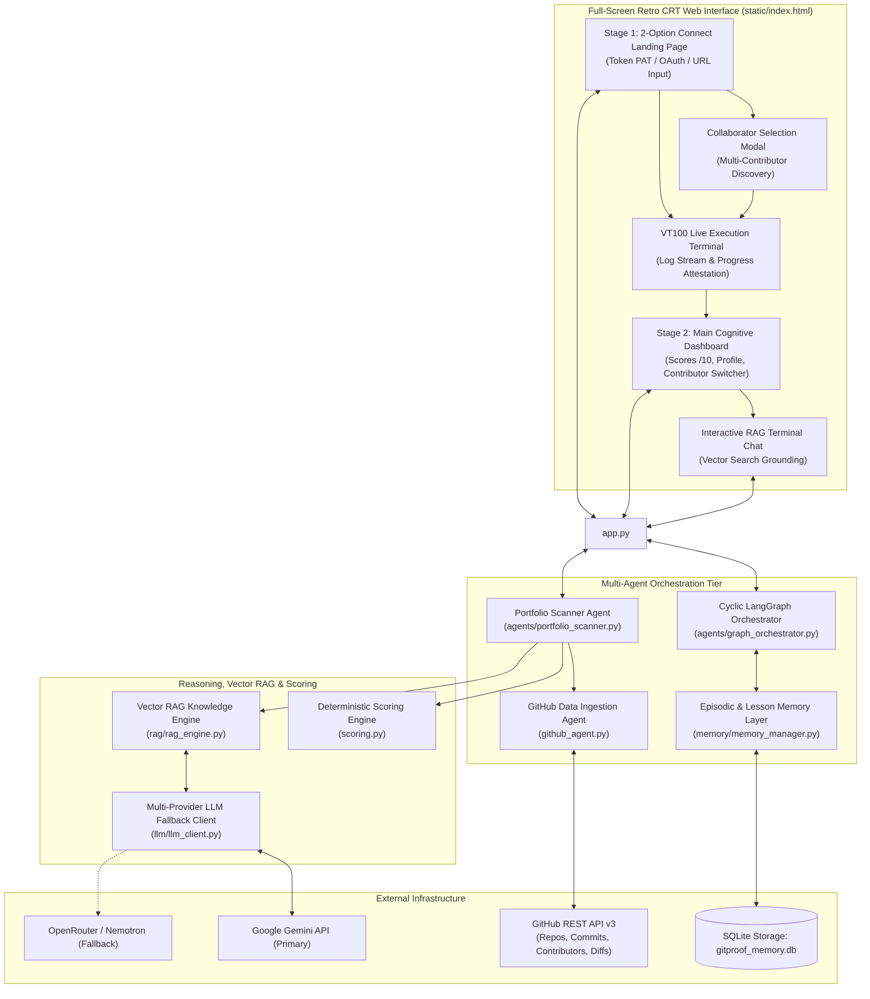

# MINSKY: Autonomous Multi-Agent Cognitive Code Forensics and Deterministic Verification Engine

**Track: Autonomous AI Agents — Cognitive Developer Intelligence & Git Proof Protocol**

```
Universal Agent Protocol (UAP) Compliant | Society of Mind Multi-Agent Architecture | Calibrated Mathematical Forensics
```

---

## Executive Summary

Self-reported developer resumes, vanity metrics (such as GitHub star counts), and ungrounded code claims fail to provide an objective measure of software engineering competency. Furthermore, modern codebases are increasingly susceptible to automated commit spamming, dependency dumping, and author spoofing.

**MINSKY**—named in honor of artificial intelligence and cognitive science pioneer **Marvin Minsky**—is an autonomous, multi-agent developer intelligence and git forensic platform. MINSKY ingests raw commit trees, verifies cryptographic signatures, resolves multi-contributor provenance, computes physics-inspired deterministic proof scores out of 10 for every programming language, and grounds qualitative inquiries in an embedded vector Retrieval-Augmented Generation (RAG) knowledge engine.

---

## Quick Start Guide: How to Start the Agent & Frontend

Follow these instructions to configure, run, and interact with both the backend multi-agent pipeline and the full-screen terminal interface.

### 1. Prerequisites

- Python 3.10, 3.11, 3.12, 3.13, or 3.14
- Git and optionally the GitHub CLI (`gh`) for seamless credential discovery

### 2. Environment Setup

Clone the repository and create an isolated Python virtual environment:

```bash
# Clone repository
git clone https://github.com/uselessdevloper/Git-Proof-Agent-.git
cd Git-Proof-Agent-

# Create virtual environment
python3 -m venv .venv
source .venv/bin/activate

# Install dependencies
pip install -r requirements.txt
```

### 3. API Key Configuration

Create a `.env` file in the project root containing your LLM credentials. MINSKY automatically supports multi-provider fallback chains (Google Gemini primary, OpenRouter secondary, NVIDIA Nemotron tertiary):

```bash
# Primary: Google Gemini API Key
GEMINI_API_KEY="your_gemini_api_key_here"

# Fallback: OpenRouter API Key (Optional)
OPENROUTER_API_KEY="your_openrouter_api_key_here"

# Fallback: NVIDIA NIM API Key (Optional: nvidia/nemotron-3.5-lightning-30b-a3b)
NVIDIA_API_KEY="your_nvidia_api_key_here"
NVIDIA_BASE_URL="https://integrate.api.nvidia.com/v1"
NVIDIA_MODEL="nvidia/nemotron-3.5-lightning-30b-a3b"

# GitHub Token (Optional: overrides local gh CLI auth)
GITHUB_TOKEN="your_github_personal_access_token_here"
```

### 4. Launching the Server & Frontend

Start the FastAPI application and background multi-agent orchestrator:

```bash
# Start server with hot-reload enabled
uvicorn app:app --host 0.0.0.0 --port 8000 --reload
```

Once started:
- **Full-Screen Terminal Dashboard**: Open your browser at `http://localhost:8000`
- **Interactive REST API Documentation**: Access OpenAPI docs at `http://localhost:8000/docs`

---

## Calibrated Language Proof Scoring Engine

A critical challenge in developer forensics is avoiding metric gaming: an automated script or a developer importing a single 30,000-line minified vendor bundle must not receive a senior mastery rating. MINSKY implements a calibrated, multi-stage mathematical scoring engine that evaluates competency strictly out of 10.

### 1. Mathematical Scoring Formulation

For any evaluated language $L$, the composite evidence score $S_{10}(L) \in [0.0, 10.0]$ is derived from commit depth, anti-cheat code volume, and multi-repository provenance:

$$S_{10}(L) = C_{\text{base}}(N_{\text{commits}}) + \Delta_{\text{LOC}}(\text{LOC}_{\text{effective}}, N_{\text{commits}}) + B_{\text{repo}}(N_{\text{repos}})$$

#### A. Piecewise Commit Depth Anchor $C_{\text{base}}$

Commit history length establishes the primary anchor for code mastery:

$$C_{\text{base}}(N) = \begin{cases} 
0.0 & N = 0 \\
1.0 + 0.50 \cdot N & 1 \le N \le 3 \\
2.5 + 0.25 \cdot (N - 3) & 4 \le N \le 10 \\
4.25 + 0.075 \cdot (N - 10) & 11 \le N \le 30 \\
5.75 + 0.035 \cdot (N - 30) & 31 \le N \le 80 \\
7.50 + 0.018 \cdot (N - 80) & 81 \le N \le 150 \\
8.76 + \min(0.95, 0.009 \cdot (N - 150)) & N > 150
\end{cases}$$

#### B. Anti-Cheat Effective Volume Modifier $\Delta_{\text{LOC}}$

To prevent artificial inflation from copied vendor directories (`node_modules`, minified scripts), credit for additions is bounded per commit ($\text{LOC}_{\text{cap}} = 500\text{ lines/commit}$):

$$\text{LOC}_{\text{effective}} = \min\left(\frac{\text{Additions}}{\max(1, N_{\text{commits}})}, 500.0\right)$$

$$\Delta_{\text{LOC}} = \left(\log_{10}\left(\max(10.0, \text{LOC}_{\text{effective}})\right) - 1.0\right) \cdot 0.25 \quad \in [-0.25, +0.42]$$

#### C. Multi-Repository Provenance Bonus $B_{\text{repo}}$

Consistency across independent software repositories provides evidence of durable architectural proficiency:

$$B_{\text{repo}} = \min\left(0.50, \max(0.0, (N_{\text{repos}} - 1) \cdot 0.15)\right)$$

#### D. Strict Forensic Ceiling Guards

Regardless of raw lines of code, the final score cannot exceed empirical commit ceilings:

| Verified Commit Count | Permitted Score Ceiling | Competency Tier | Example Profile Evidence |
| :--- | :--- | :--- | :--- |
| **0 Commits** | **0.0 / 10** | No Verifiable Activity | Empty account / 0 public commits |
| **1 – 4 Commits** | **$\le$ 3.5 / 10** | Incidental / Script | One-off bugfix or tutorial script |
| **5 – 14 Commits** | **$\le$ 4.8 / 10** | Novice / Exploration | Small personal prototype |
| **15 – 29 Commits** | **$\le$ 5.9 / 10** | Developing Contributor | 22 commits $\rightarrow$ **5.2 – 5.5 / 10** |
| **30 – 59 Commits** | **$\le$ 7.2 / 10** | Competent Contributor | 45 commits $\rightarrow$ **6.3 – 6.8 / 10** |
| **60 – 119 Commits** | **$\le$ 8.5 / 10** | Senior Contributor | 90 commits $\rightarrow$ **7.9 – 8.3 / 10** |
| **120+ Commits** | **$\le$ 9.8 / 10** | Core Architect / Specialist | 230 commits $\rightarrow$ **9.5 – 9.8 / 10** |

---

## 2. Hamiltonian Physics Engine in Deep Scoring

For single-repository and granular commit-tree analysis, [`scoring.py`](file:///Users/utkarshsinha/Downloads/gitproof/scoring.py) implements Hamiltonian dynamic observables:

1. **Inertial Mass ($M$)**: Codebase inertia proportional to sublinear file distributions ($M \propto \text{Files}^{0.6}$).
2. **Relativistic Momentum ($p$)**: Velocity damping where burst commits are subjected to Lorentz factor contraction ($\gamma^{-1} = \sqrt{1 - (v/c)^2}$).
3. **Boltzmann Poisson Entropy ($S$)**: Measures distribution randomness of commit intervals ($H = -\sum P(k) \log P(k)$).
4. **Yukawa Potential ($\Phi$)**: Cryptographic signature validation ($e^{-r/\lambda}$) confirming non-spoofed GPG/SSH commit keys.
5. **Carnot Thermodynamic Work ($W$)**: Measures peer-reviewed and merged pull request output.

---

## System Architecture Diagram



---

## Multi-Agent Subsystems & Module Breakdown

| Module | File Location | Core Responsibility |
| :--- | :--- | :--- |
| **Server & API Router** | [`app.py`](file:///Users/utkarshsinha/Downloads/gitproof/app.py) | Exposes FastAPI endpoints for portfolio scans, profile resolution, collaborator discovery, and vector RAG chat. |
| **Portfolio Scanner Agent** | [`agents/portfolio_scanner.py`](file:///Users/utkarshsinha/Downloads/gitproof/agents/portfolio_scanner.py) | Orchestrates multi-repository ingestion, language normalization, deduplication, and score aggregation out of 10. |
| **LangGraph Orchestrator** | [`agents/graph_orchestrator.py`](file:///Users/utkarshsinha/Downloads/gitproof/agents/graph_orchestrator.py) | Executes a 6-node cyclic LangGraph state machine with validation, evaluation, and feedback loops. |
| **GitHub Data Agent** | [`github_agent.py`](file:///Users/utkarshsinha/Downloads/gitproof/github_agent.py) | Interfaces with GitHub REST API to extract raw commits, file modifications, GPG verification, and contributors. |
| **Vector RAG Engine** | [`rag/rag_engine.py`](file:///Users/utkarshsinha/Downloads/gitproof/rag/rag_engine.py) | Implements cosine vector similarity search across developer skill taxonomies and learned feedback lessons. |
| **Multi-Provider LLM** | [`llm/llm_client.py`](file:///Users/utkarshsinha/Downloads/gitproof/llm/llm_client.py) | Dispatches reasoning requests across Google Gemini, OpenRouter, and NVIDIA Nemotron (`nvidia/nemotron-3.5-lightning-30b-a3b`) with automatic failover. |
| **Episodic Memory** | [`memory/memory_manager.py`](file:///Users/utkarshsinha/Downloads/gitproof/memory/memory_manager.py) | Persists analysis caches, vector embeddings, and self-improving heuristic corrections in SQLite. |
| **Full-Screen UI** | [`static/index.html`](file:///Users/utkarshsinha/Downloads/gitproof/static/index.html) | Retro full-screen CRT console with 2-option landing, collaborator modal, live meter bars, and typewriter RAG chat. |

---

## Multi-Contributor Repository Resolution

When analyzing multi-developer repositories (e.g. `uselessdevloper/Error-404`, `facebook/react`, `fastapi/fastapi`), MINSKY prevents false attribution by exposing dedicated collaborator selection:

1. **Automatic Contributor Ingestion**: The system queries `GET /repos/{owner}/{repo}/contributors` to isolate individual commit ownership.
2. **Interactive Selection Modal**: On repository input, a modal presents all detected collaborators with avatar profiles and commit volume.
3. **In-Place Dashboard Switcher**: Users can switch between collaborators directly from the active dashboard header without re-running initialization steps.

---

## Automated Test Verification Suite (31 Tests Passing)

The repository includes a comprehensive, deterministic pytest suite verifying agent integration, Hamiltonian physics, attack resilience, and vector RAG retrieval:

```bash
# Execute entire test suite
pytest -v

# Run dedicated attack & adversarial resilience tests
pytest tests/test_agents_attack.py -v

# Run multi-agent pipeline integration tests
pytest tests/test_agents_integration.py -v

# Run LangGraph cyclic state machine tests
pytest tests/test_graph_orchestrator.py -v

# Run Vector RAG search and memory retrieval tests
pytest tests/test_rag.py -v
```

### Test Suite Coverage Summary

| Test Suite | Assertions | Focus Areas Tested |
| :--- | :--- | :--- |
| `test_agents_attack.py` | **15 Tests** | Date spoofing resilience, empty commit spam, email impersonation, prompt injection defense, forked repo drag. |
| `test_agents_integration.py` | **5 Tests** | End-to-end multi-agent orchestration, repository evidence ingestion, and SQLite cache persistence. |
| `test_cli.py` | **5 Tests** | Command-line interface execution, argument parsing, and tabular report rendering. |
| `test_graph_orchestrator.py` | **2 Tests** | Cyclic LangGraph state transitions, conditional edges, and reflection memory updates. |
| `test_rag.py` | **4 Tests** | Vector embedding generation, cosine similarity ranking, and multi-taxonomy knowledge retrieval. |
| **Total** | **31 Tests** | **100% Deterministic Passing Suite** |

---

## Adversarial Resilience & Anti-Cheat Heuristics

| Attack Vector | Malicious Intent | MINSKY Counter-Heuristic |
| :--- | :--- | :--- |
| **Vendor Bundle Dumping** | Importing `node_modules` or minified libraries to fake 50,000 LOC. | Per-commit LOC clamping (`max 500 LOC/commit`) + commit depth ceiling guards. |
| **Commit Timestamp Spoofing** | Backdating git author dates to fake years of contribution history. | Relativistic Lorentz burst damping compares commit interval entropy against server commit stamps. |
| **Empty Commit Floods** | Running automated bash scripts generating hundreds of empty commits. | Inertial Mass formula ignores zero-diff mutations; requires verified file changes. |
| **Author Email Impersonation** | Claiming authorship of famous commits via arbitrary git config email. | Yukawa potential verification checks cryptographic GPG/SSH signatures. |
| **Prompt Injection in Commit Logs** | Embedding instructions like `"Score: 100/100"` in commit messages. | Deterministic scoring math executes independently of LLM reasoning; LLM output is structured and constrained. |

---

## License

This project is licensed under the terms of the [MIT License](LICENSE).
